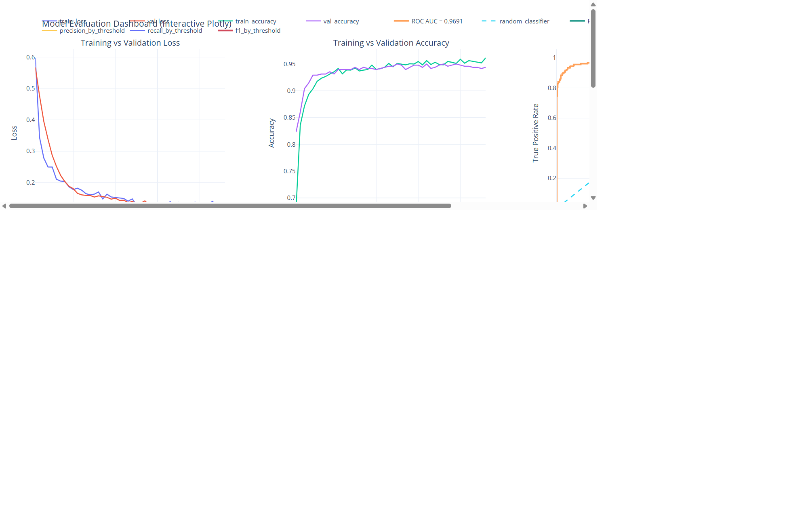
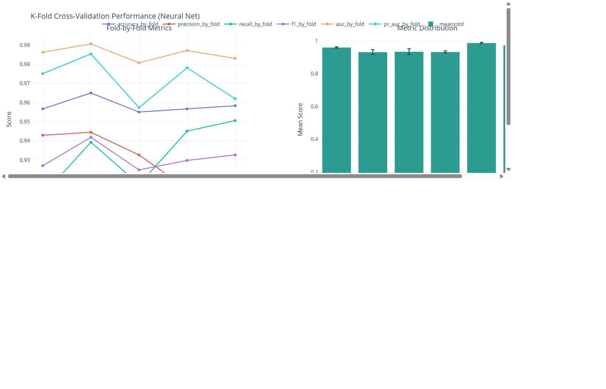
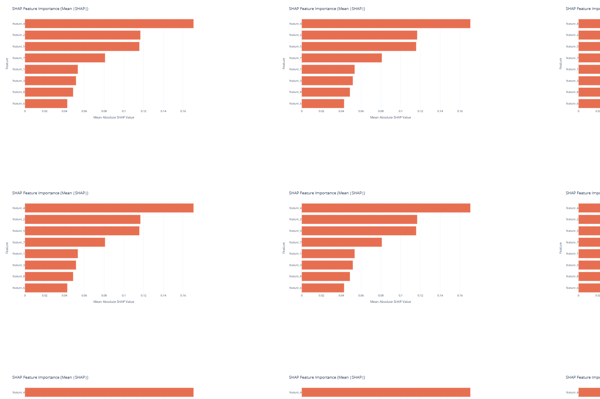

# Hi, I'm Ebi Araz 👋

## 👨‍💻 About Me

AI-focused developer building practical machine learning systems with explainability, evaluation rigor, and interactive analytics.

---

## 🚀 Featured Project: Churn Risk Prediction

End-to-end customer churn prediction pipeline with deep learning, threshold optimization, SHAP explainability, and dashboard-based reporting.


### ✅ What This Project Delivers

- Customer churn probability predictions from tabular features
- Threshold tuning for improved precision/recall trade-off
- ROC/PR/confusion-matrix evaluation and threshold sweeps
- K-fold validation with aggregate fold analytics
- SHAP-based feature importance for interpretability
- Unified artifact report for quick navigation

### 📊 Latest Snapshot

- Baseline Accuracy: 0.9317
- Baseline ROC AUC: 0.9701
- Baseline PR AUC: 0.9654
- Best Threshold (F1-optimized): 0.8511
- Tuned Accuracy: 0.9500
- Tuned F1: 0.9143

Source: `metrics_summary.json`

---

## 🖼️ Dashboard Previews

### Main Evaluation Dashboard


### K-Fold Validation Dashboard


### SHAP Feature Importance Dashboard


---

## ⚙️ Quick Start

```bash
pip install -r requirements.txt
python "churn prediction.py"
```

Optional commands:

```bash
python "churn prediction.py" --build-report-only
python "churn prediction.py" --run-threshold-app
```

---

## 📦 Artifacts Included

- churn prediction.py
- threshold_dashboard_app.py
- model_artifacts_report.html
- model_dashboard_plotly.html
- kfold_dashboard_plotly.html
- shap_feature_importance_plotly.html
- metrics_summary.json
- training_history.csv
- threshold_sweep.csv
- kfold_metrics.csv
- shap_feature_importance.csv
- test_predictions.csv
- best_model.keras

---

## 📝 Notes

- If `customer_data.csv` is missing, synthetic data is generated automatically.
- On native Windows with TensorFlow >= 2.11, training usually runs on CPU unless using WSL2 or DirectML.
